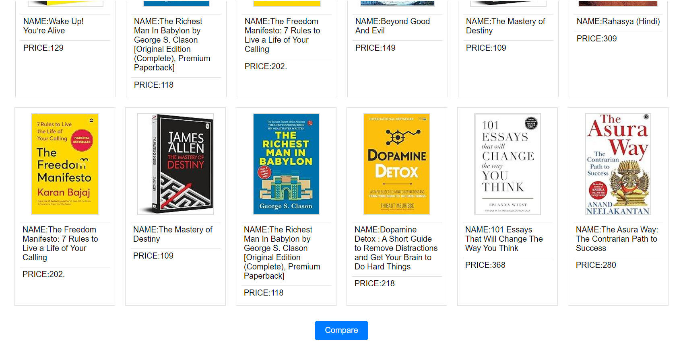
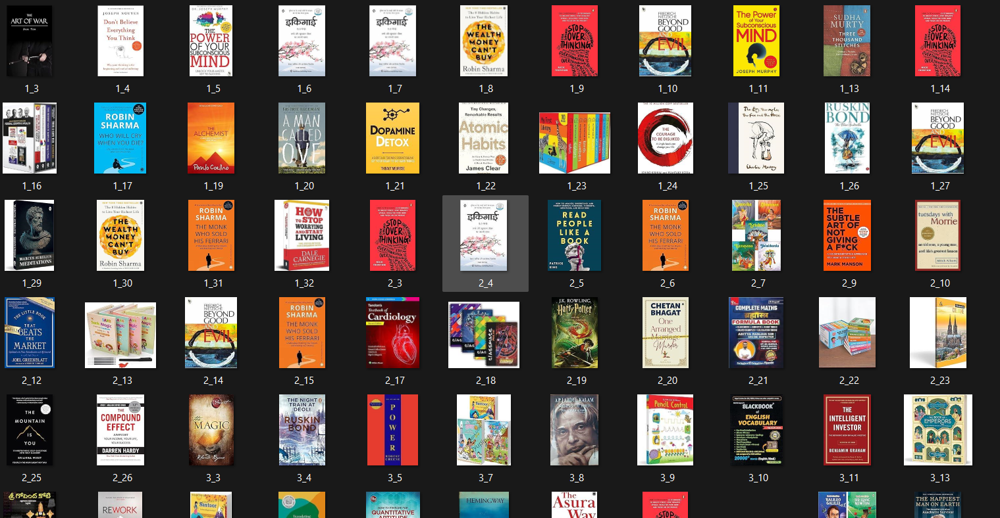

# E-commerce Scraper Project

## Overview

This project is a web application that scrapes images and product details (name, price,description, rating) from an e-commerce website (e.g., Amazon) and displays them in a user-friendly format. Users can select multiple images to compare the products.

## Features

- Display scraped images along with product name, price, and rating.
- Select images by clicking on them.
- Compare selected images and view detailed comparison.


## Setup Instructions

1. **Clone the repository:**

    ```bash
    git clone https://github.com/Vanshikaaga/AspireNex.git
    cd ecommerce-scraper
    ```

2. **Create and activate a virtual environment:**

    ```bash
    python3 -m venv venv
    source venv/bin/activate  # On Windows, use `venv\Scripts\activate`
    ```

3. **Install the required packages:**

    ```bash
    pip install -r requirements.txt
    ```

4. **Run the application:**

    ```bash
    python amazon_search_image_scraper.py
    ```

5. **Open your browser and navigate to:**

    ```
    http://127.0.0.1:5000/
    ```

## Usage

1. **Scrape Product Data:**
   - The `amazon_search_image_scraper` script in the `ecommerce-scrapper` directory contains the logic to scrape product images and details from the e-commerce website.
   - Ensure you have the necessary permissions to scrape the website.
   - Save the scraped images in the `static/images/` directory and details in `data.csv`.

2. **View and Select Products:**
   - The homepage displays the scraped images with product names, prices, and ratings.
   - Click on an image to select it. Selected images will have a highlighted border.
   - The selected images will be stored and can be compared by clicking the "Compare" button.

3. **Compare Products:**
   - After selecting images, click on the "Compare" button to view a detailed comparison of the selected products.

## Project Files


- `amazon_search_image_scraper`: Script for scraping images and product details.
- `templates/index.html`: HTML template for displaying images and product details.
- `templates/compare.html`: HTML template for comparing the products.
- `static/images/`: Directory to store scraped images.
- `data.csv`: CSV file to store product details (name, price, rating, image filename).
- `README.md`: This file.

## Dependencies

- Flask
- BeautifulSoup4
- Requests

To install the dependencies, run:

```bash
pip install -r requirements.txt

## Screenshots

 
 
 
 
